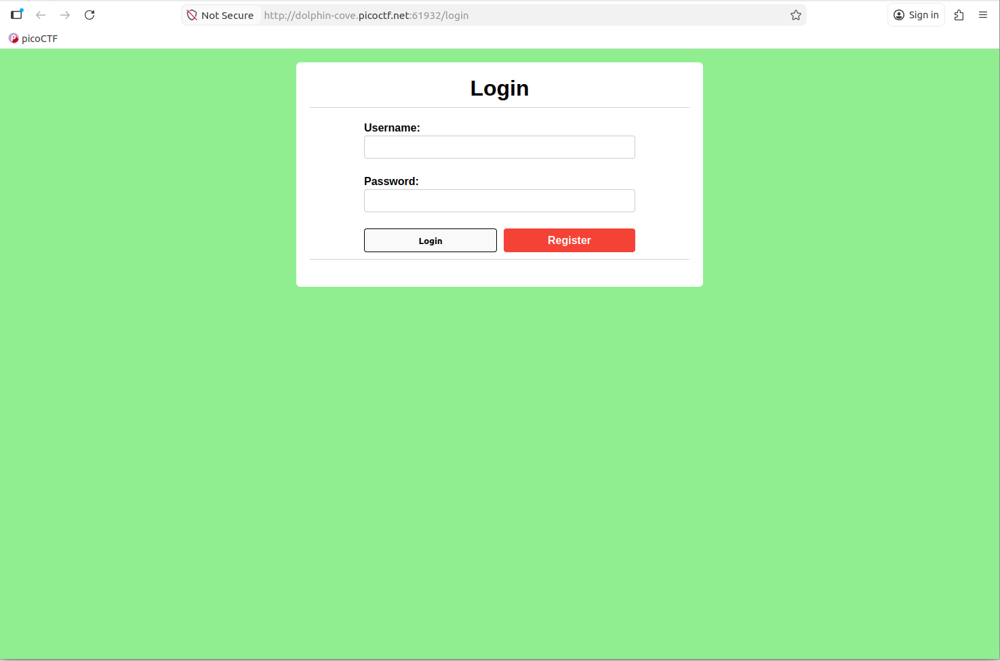
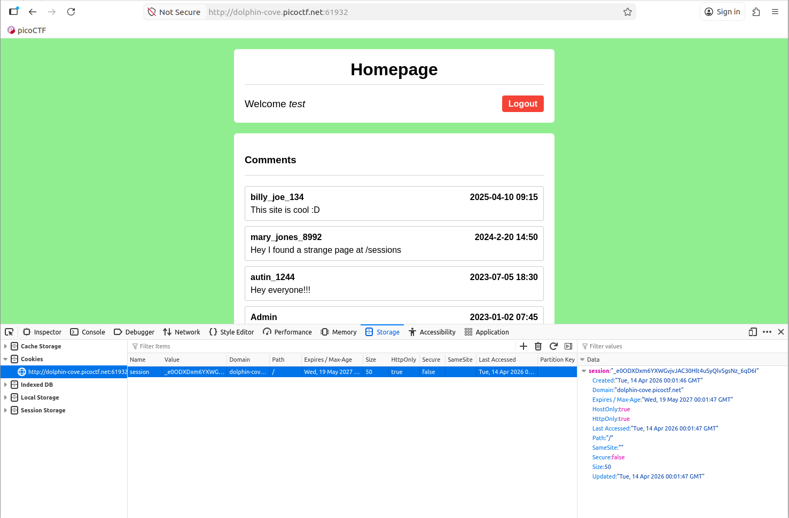
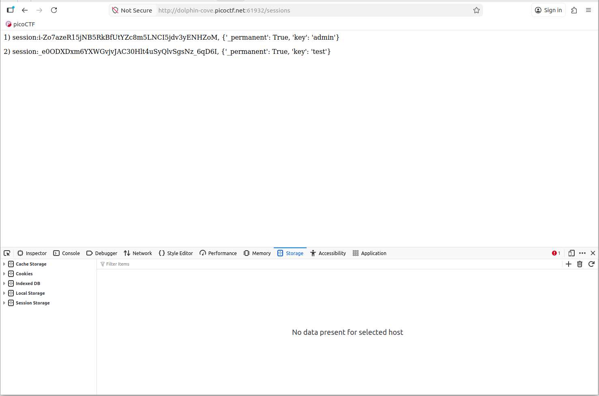
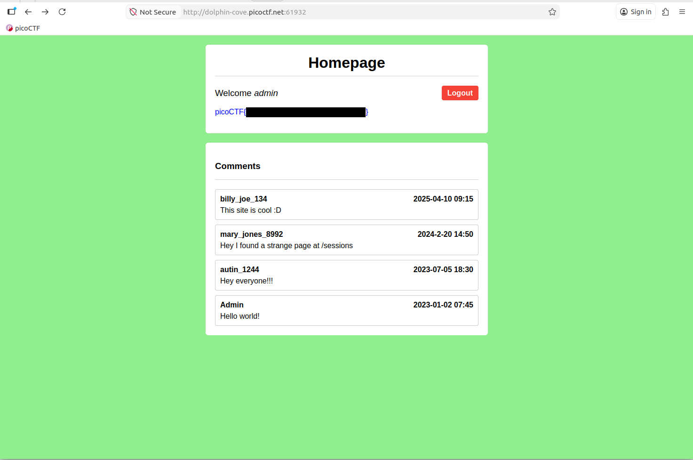

# Old Sessions #

## Overview ##

Difficulty: Easy

Category: [Web Exploitation](../)

Tags: `#webexploitation #cookie #session`

## Description ##

Proper session timeout controls are critical for securing user accounts. If a user logs in on a public or shared computer but doesn’t explicitly log out (instead simply closing the browser tab), and session expiration dates are misconfigured, the session may remain active indefinitely. 
This then allows an attacker using the same browser later to access the user’s account without needing credentials, exploiting the fact that sessions never expire and remain authenticated.

## Approach ##

Opening the challenge link in a browser, displays a typical `Login/Register` form at `/login` URI.

Clicking on the `Register` button navigates to the `Register` specific form at `/register`. Entering dummy details for `Username` and `Password`s and submitting with the `Register` button, creates a new account we can login with.

Returning to the `Login` form and after logging in successfully with the newly created dummy credentials, we are redirected to a `Homepage`. Using the browsers Web Developer tools, we can inspect the cookie created for our new session.

I missed it at first, but in the table of `Comments` is a reference to `/sessions` URI. Updating the URL in the address bar to add this dumps a list of sessions, including our current session (cross referencing the Cookie value with the data presented.

Leaking all the information we need to hijack the `admin` user's session.

## Solution ##

Using the browsers web inspector our sessions Cookie value can be modified to the value leaked for the `admin` users session. Refreshing the `Homepage` and we are welcomed as the `Admin` and the flag is displayed.

Where the actual flag value has been redacted for the purposes of this write up.
