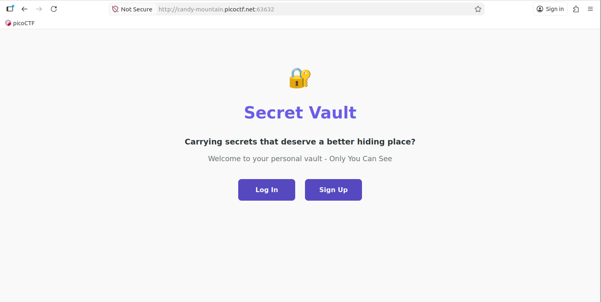
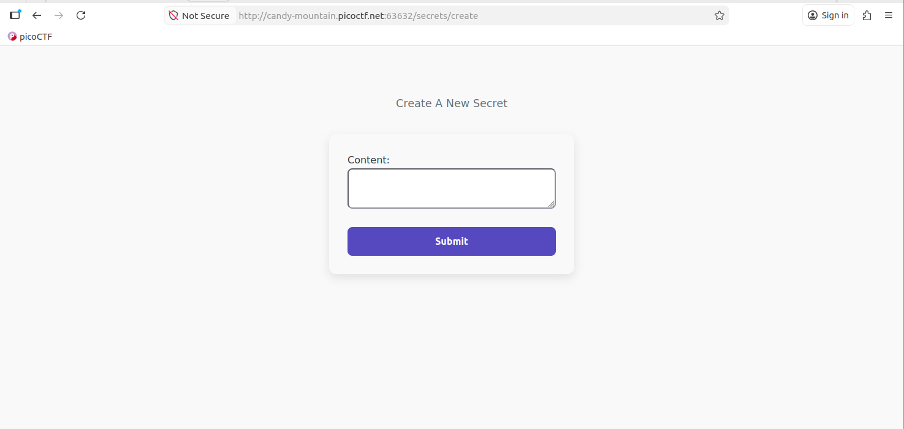
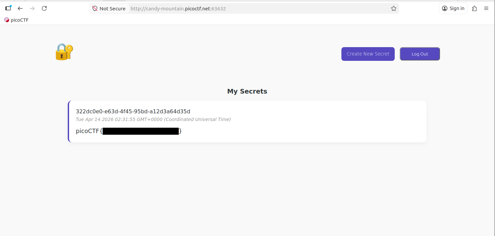

# Secret Box #

## Overview ##

Difficulty: Medium

Category: [Web Exploitation](../)

Tags: `#webexploitation #sql #sqlinjection #sqli #node.js`

## Description ##

This secret box is designed to conceal your secrets. It's perfectly secure—only you can see what's inside. Or can you? Try uncovering the admin's secret. 
Browse here, can you find the secret message? 
Download the source code here.

## Approach ##

Downloading and extracting the challenge source code, we can analyse the database structure (`db/initdb.sql`) and web endpoints (`app/src/server.js`).

    $ tar -xvf source.tar.gz 
    ./source/
    ./source/docker-compose.yml
    ./source/db/
    ./source/db/initdb.sql
    ./source/db/Dockerfile
    ./source/app/
    ./source/app/src/
    ./source/app/src/db.js
    ./source/app/src/handler.js
    ./source/app/src/server.js
    ./source/app/src/views/
    ./source/app/src/views/create_secret.ejs
    ./source/app/src/views/index.ejs
    ./source/app/src/views/login.ejs
    ./source/app/src/views/my_secrets.ejs
    ./source/app/src/views/signup.ejs
    ./source/app/Dockerfile

Analysing all the endpoints handled within `app/src/server.js` that access the database, they all use the Node.js `'?'` placeholder in their queries that sanitises input. Except for one!

    app.post('/secrets/create', authMiddleware, async (req, res) => {
        const userId = req.userId;
        if (!userId){
            // if user didn't login, redirect to index page
            res.clearCookie('auth_token');
            return res.redirect('/');
        }

        const content = req.body.content;
        const query = await db.raw(
            `INSERT INTO secrets(owner_id, content) VALUES ('${userId}', '${content}')` 
        );

        return res.redirect('/');
    });

Which uses `${content}` directly without sanitisation, from the `POST`'ed request and under user control (input).

To access this endpoint, after opening the challenge link in a web browser, we are presented with a page that provides links to either `Login` or `Sign Up`.

As we don't have an account yet, navigating to `Sign up` we can provide a `Name` and `Password` to create an account using the `/signup` endpoint, which we can then use to `Login`.

Once logged in, we are presented with the following page, that displays all of our secrets we've created and allows up to `Create New Secret` or `Log Out`.

The `Create New Secret` link navigates to the `create_secret.ejs` served view, and submission of a new secret utilises the exploitable `/secrets/create` endpoint.

The `SQL` query used in this endpoint is an `INSERT` statement, meaning it is not actually fetching any data to display that we could use to leak information from the database. After a bit of thought I realised we didn't need to, we have everything we need.

Inspecting the contents of `db/initdb.sql` from the source code we can see the database structure and details of the `admin` account, that has a pre-populated secret... our flag:

    $ cat db/initdb.sql 
    CREATE EXTENSION IF NOT EXISTS pgcrypto;

    CREATE TABLE users (
        id text PRIMARY KEY DEFAULT gen_random_uuid(),
      username text NOT NULL,
        password text NOT NULL,
        created_at timestamptz NOT NULL DEFAULT now()
    );

    CREATE TABLE tokens (
        id text PRIMARY KEY DEFAULT gen_random_uuid(),
        user_id text NOT NULL REFERENCES users(id),
        created_at timestamptz NOT NULL DEFAULT now(),
      expired_at timestamptz NOT NULL DEFAULT now() + interval '1 days'
    );

    CREATE TABLE secrets (
        id text PRIMARY KEY DEFAULT gen_random_uuid(),
        owner_id text NOT NULL REFERENCES users(id),
        content text NOT NULL,
        created_at timestamptz NOT NULL DEFAULT now()
    );

    INSERT INTO users(id, username, password) VALUES ('e2a66f7d-2ce6-4861-b4aa-be8e069601cb', 'admin', 'fake_password');
    INSERT INTO secrets(owner_id, content) VALUES ('e2a66f7d-2ce6-4861-b4aa-be8e069601cb', 'picoCTF{fake_flag}');

So our attack in this case will be create a new secret with content that will an inject additional SQL statement to modify the `admin` accounts password to something we specify and hence can use to log into.

## Solution ##

The input used for the `Content` field for our new secret was:

    foo'); UPDATE users SET password='qwerty' WHERE username='admin'; --

Where;
- `foo` : is not required, but is just some dummy content to populate the secret with
- `'` : closes out `content` input string
- `);` : closes out the `VALUES` field of the `SQL INSERT` query and `;` terminates the statement.
- `UPDATE users SET password='qwerty' WHERE username='admin';` : is our injected `SQL` statement to modify the `admin` users password to `qwerty`.
- `--` : comments out the remainder of the original `INSERT` query.

After submitting this secret, we can `Log Out` and then log back in with the `admin` account credentials. This shows the `admin`'s secrets and drops our flag:

Where the actual flag value has been redacted for the purposes of this write up.
